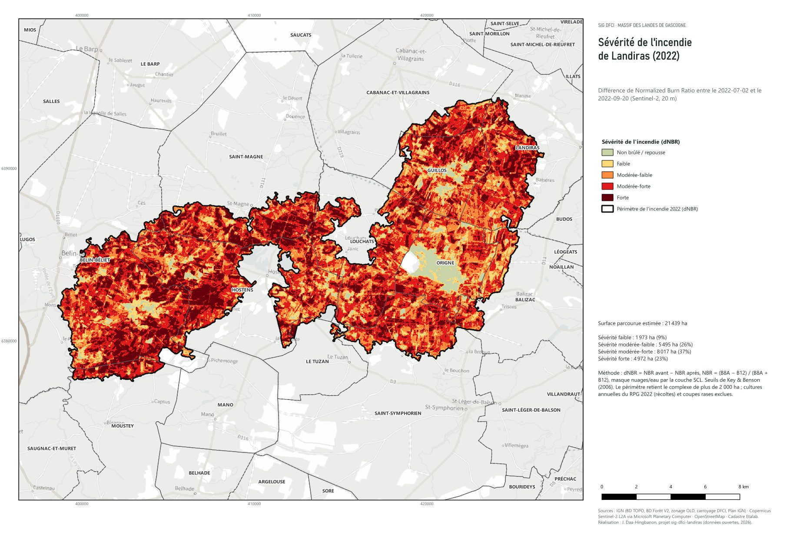
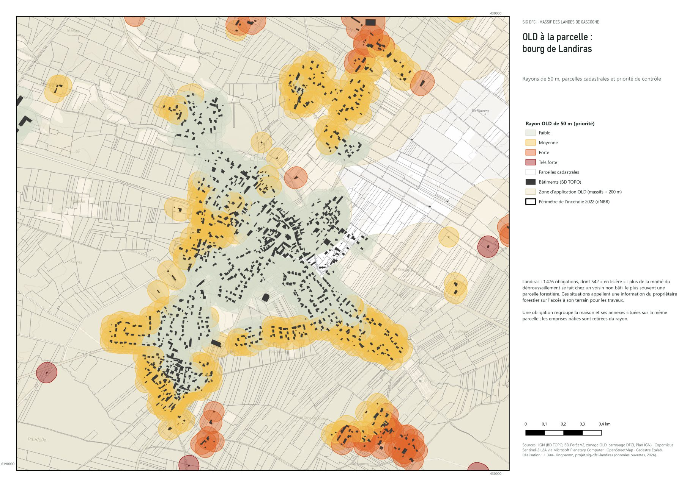
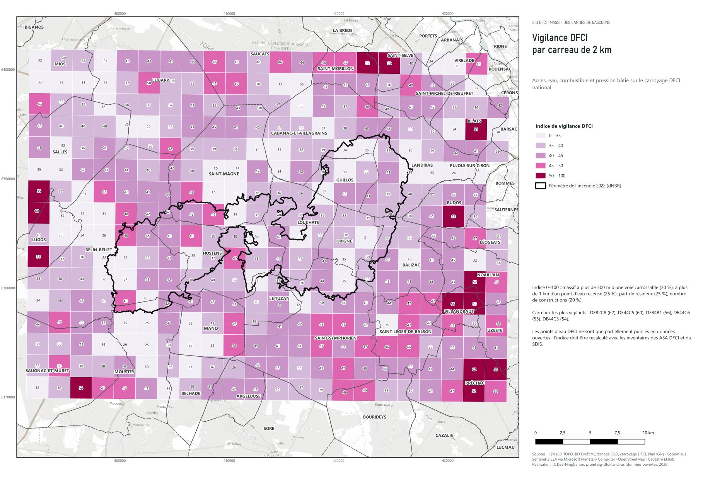
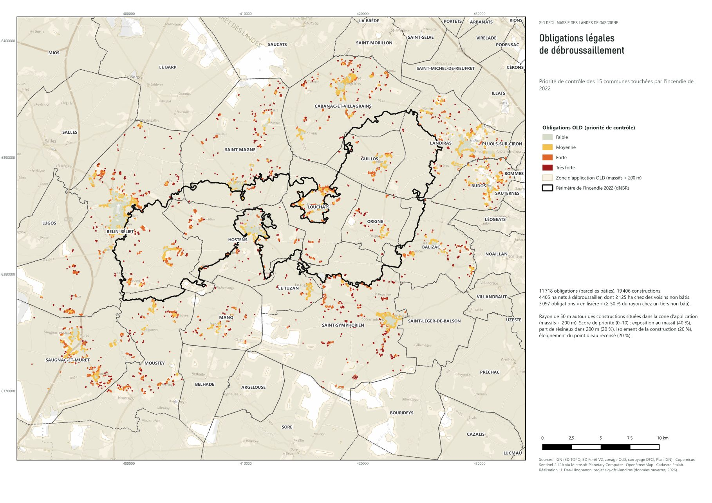
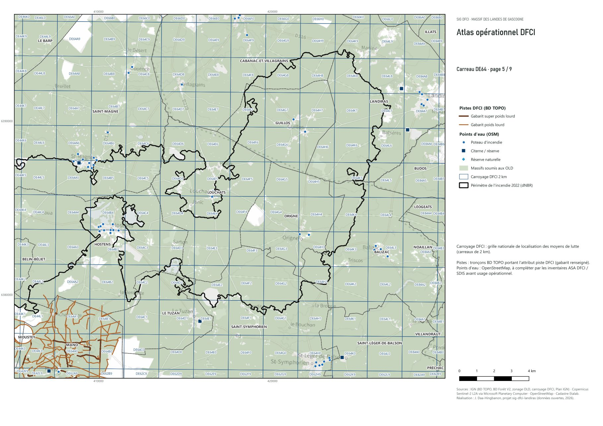

# SIG DFCI · Landiras 2022

[](https://github.com/jauresmas/sig-dfci-landiras/actions/workflows/controle.yml)

Un SIG de **défense des forêts contre l'incendie** construit uniquement avec des données ouvertes, sur le
massif des Landes de Gascogne autour de l'incendie de Landiras (Gironde, 2022). Il couvre la cartographie
post-incendie par télédétection, le calcul des **obligations légales de débroussaillement (OLD)** à la
parcelle, un diagnostic de défendabilité sur le **carroyage DFCI**, une base de données DFCI (GeoPackage et
PostGIS), un atlas opérationnel et un formulaire de contrôle terrain pour **QField**.

**[Voir la carte interactive →](https://jauresmas.github.io/sig-dfci-landiras/)**



## Résultats

| | |
|---|---|
| Surface parcourue (dNBR Sentinel-2) | **21 439 ha**, dont 4 972 ha en sévérité forte et 8 017 ha en modérée-forte |
| Communes étudiées | 15 communes touchées par le feu (Gironde et Landes) |
| Obligations de débroussaillement | **11 718** parcelles bâties (19 406 constructions), **4 405 ha nets** à débroussailler |
| Débroussaillement chez des tiers | **2 125 ha** sur des parcelles voisines non bâties ; **3 097** obligations « en lisière » (26 %) |
| Priorité de contrôle forte ou très forte | **2 897** obligations |
| Diagnostic DFCI | 347 carreaux de 2 km, 117 300 ha de massif ; 0,7 % du massif à plus de 500 m d'une voie carrossable |

Trois constats ressortent :

1. **Le débroussaillement déborde massivement sur les voisins.** Les parcelles bâties font 1 087 m² en
   médiane, alors qu'un rayon de 50 m couvre près d'un hectare : chaque obligation touche en moyenne
   15 parcelles voisines. Une obligation sur quatre se réalise
   majoritairement sur une parcelle non bâtie, souvent forestière : ce sont les situations où l'information
   des propriétaires forestiers conditionne l'efficacité des OLD.
2. **Les équipements DFCI publiés en données ouvertes sont très incomplets.** L'attribut « piste DFCI » de la
   BD TOPO couvre 558 km côté Landes mais seulement 6 km côté Gironde. Les points d'eau accessibles sont
   surtout des hydrants de bourg (OpenStreetMap). L'indicateur « massif à plus de 1 km d'un point d'eau
   recensé » (87 %) mesure donc d'abord un manque de données. Première action : intégrer les inventaires
   des ASA DFCI et du SDIS.
3. **Le dNBR confond les récoltes avec du brûlé.** Entre juillet et septembre, 4 483 ha de cultures annuelles
   (maïs sous pivot, céréales) présentent un dNBR élevé. Les exclure grâce au RPG 2022 fait passer les faux
   positifs autour du feu de 6 229 à 1 877 ha.

| | |
|---|---|
|  |  |
| OLD à la parcelle, bourg de Landiras | Indice de vigilance par carreau DFCI de 2 km |
|  |  |
| Priorités de contrôle OLD, 15 communes | Atlas opérationnel, une page par carreau de 20 km |

## Chaîne de traitement

Chaque étape est un script autonome qui lit et écrit dans `data/`. `lancer_chaine.py` les enchaîne.

| Script | Rôle |
|---|---|
| `00_telechargement.py` | WFS Géoplateforme IGN (BD TOPO, BD Forêt V2, zonage OLD, carroyage DFCI, RPG 2022), Overpass OSM. Pagination, dédoublonnage, retéléchargement automatique si l'emprise change. |
| `01_severite_dnbr.py` | Sentinel-2 L2A via le STAC Planetary Computer (lecture fenêtrée des COG, même orbite avant/après), NBR, dNBR, classes de Key & Benson, masque nuages SCL, exclusion des cultures RPG, périmètre par morphologie mathématique. |
| `02_analyse_old.py` | Zone d'application officielle contrôlée par recalcul (écart de 3,7 % avec massifs + 200 m), une obligation par parcelle bâtie, rayons de 50 m hors emprises bâties, débords sur le cadastre Etalab, score de priorité. |
| `03_base_dfci.py` | GeoPackage DFCI : 9 tables et 7 listes de valeurs écrites comme domaines de champs (listes déroulantes automatiques dans QGIS et QField). |
| `04_diagnostic_carreaux.py` | Transformées de distance à 20 m (voies, pistes, points d'eau), part de résineux, surfaces brûlées, pression bâtie, indice de vigilance par carreau DFCI. |
| `05_cartographie.py` | PyQGIS sans interface : projet QGIS stylé, 4 cartes A3 et un atlas de 9 pages sur les carreaux DFCI de 20 km. |
| `06_projet_qfield.py` | Projet QField de contrôle OLD (voir plus bas). |
| `07_export_web.py` | GeoJSON simplifiés, raster de sévérité en PNG Web Mercator, chiffres clés pour la carte web. |

Les traitements reposent sur GeoPandas, Rasterio et SciPy : ils se transposent directement en ArcPy ou en
workbench FME.

## Modèle de données

`sql/schema_dfci_postgis.sql` décrit la base DFCI en PostgreSQL/PostGIS :

- schéma `ref` pour les **listes de valeurs** (types de points d'eau, états, catégories de pistes, statuts et
  suites de contrôle OLD…) en tables plutôt qu'en ENUM, pour pouvoir les faire évoluer sans migration ;
- schéma `dfci` : `carreau_dfci`, `zonage_old`, `piste`, `point_eau`, `point_interet`, `incendie`,
  `old_obligation`, `controle_old`, `patrouille` ;
- **déclencheurs** : traçabilité (auteur, dates), carreau DFCI d'un point d'eau renseigné automatiquement,
  statut d'une obligation mis à jour par son contrôle le plus récent ;
- **contraintes** : géométries typées et valides, « non conforme ⇒ suite obligatoire », dates cohérentes ;
- **vues de pilotage** : avancement des contrôles par commune, points d'eau à visiter avant la saison,
  impasses sans aire de retournement.

`sql/tests_schema.sql` vérifie ces comportements. L'intégration continue GitHub Actions monte une base
PostGIS et exécute le schéma puis les tests à chaque push.

## Contrôle terrain avec QField

`qfield/controle_old.qgz` embarque les 2 897 obligations prioritaires, les pistes, les points d'eau et le
carroyage. Le formulaire de contrôle :

- est organisé en onglets (Contrôle, Constat, Suite) ;
- préremplit la date, l'agent et l'identifiant de l'obligation la plus proche du point saisi ;
- propose les listes de valeurs du modèle, avec une photo en pièce jointe ;
- refuse une non-conformité sans suite, comme la contrainte PostGIS.

## Reproduire

```bash
git clone https://github.com/jauresmas/sig-dfci-landiras.git
cd sig-dfci-landiras
# environnement Python de QGIS 3.34 (Windows), qui contient déjà GeoPandas, Rasterio et SciPy
"C:\Program Files\QGIS 3.34.12\bin\python-qgis-ltr.bat" lancer_chaine.py
```

La première exécution télécharge environ 330 Mo ; comptez de l'ordre de 20 minutes selon la connexion. Emprise, dates d'images
et paramètres réglementaires se règlent dans `config.py`.

```
config.py              emprise, dates Sentinel-2, rayons OLD
scripts/               chaîne de traitement 00 → 07
sql/                   modèle PostGIS et tests
projet/                projet QGIS généré
qfield/                projet de contrôle terrain
docs/                  carte web (GitHub Pages) et aperçus des cartes
sorties/               synthèses CSV (les PDF sont régénérés dans sorties/cartes/)
```

## Limites

- **Travail de démonstration sans valeur réglementaire.** Les obligations réelles dépendent de l'arrêté
  préfectoral, des zones U des PLU (débroussaillement de toute la parcelle), des arrêtés municipaux (rayon
  porté à 100 m) et de la propriété réelle : faute d'accès aux Fichiers fonciers, une parcelle voisine
  appartenant au même propriétaire est comptée comme « tiers ».
- Le périmètre dNBR n'est pas le contour officiel du SDIS : il ne tient pas compte des îlots non brûlés
  à l'intérieur, et les seuils de sévérité n'ont pas été calibrés par des relevés de terrain (CBI).
- Les distances sont à vol d'oiseau, pas le long du réseau de pistes.
- Pistes et points d'eau DFCI : voir le constat n° 2.

## Sources

IGN Géoplateforme (BD TOPO, BD Forêt V2, zonage des OLD, carroyage DFCI, RPG 2022, Plan IGN, BD ORTHO),
Copernicus Sentinel-2 L2A via Microsoft Planetary Computer, cadastre Etalab (DGFiP), OpenStreetMap
(ODbL). Code sous licence MIT.

---
Jaurès Daa-Hingbanon, ingénieur géomaticien
